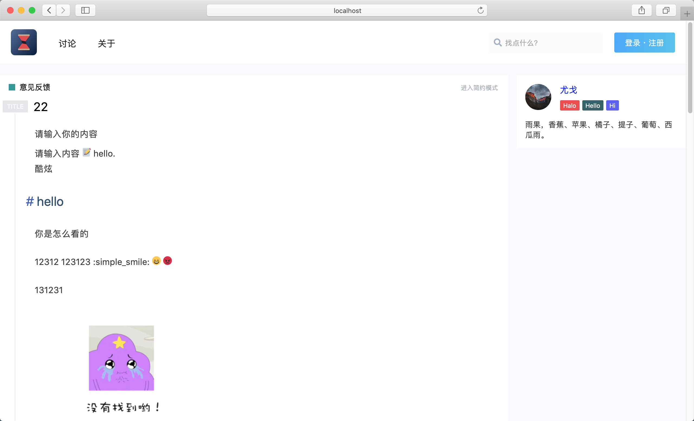
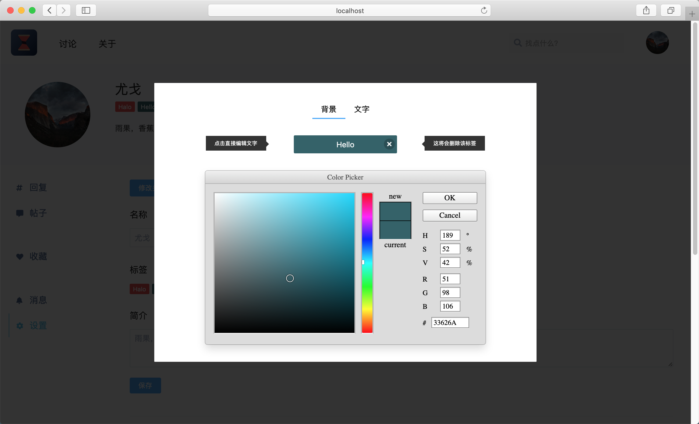

# yaoyao

Yaoyao is a modern forum application.

YaoYao 是现代化的论坛应用





# dependent 依赖

* mongodb
* upyun.com cloud file storage service

# how to install 如何安装

```
cp .env.example .env
vim .env # edit the config file 修改配置文件
```

```
npm run dev
```

if you want edit data in local，you should config admin masterKey in `package.json` script

```
"deploy:admin": "parse-dashboard --appId 1 --masterKey 000000 --serverURL \"http://localhost:3000\"",
```

```
npm run deploy:admin
```


# Open 打开

* http://localhost:3000
* http://localhost:3000/dashboard

dashboard config in `server.js`

```
users: [
    {
        user: "yaoyao", // 控制台登陆
        pass: "xiaoyaoyao"
    }
],
```


# admin 管理

在前端是有管理权限的，进入 `Dashboard` 新建一个叫 `Administrator` 的角色，把用户添加进去即可，就拥有了管理权限，可在前端 CURD 所有用户的资源。


At the front end, there are administrative privileges, enter the `Dashboard`, create a new role called `Administrator`, add the user can be added, you have administrative privileges, can be in the front end CURD resources of all users.


# 许可 License

free use for person but keep myname in footer and github link

个人免费（或者开源组织）使用，保留页脚的名字跟 github 链接

For commercial use, please contact

商业使用请联系。